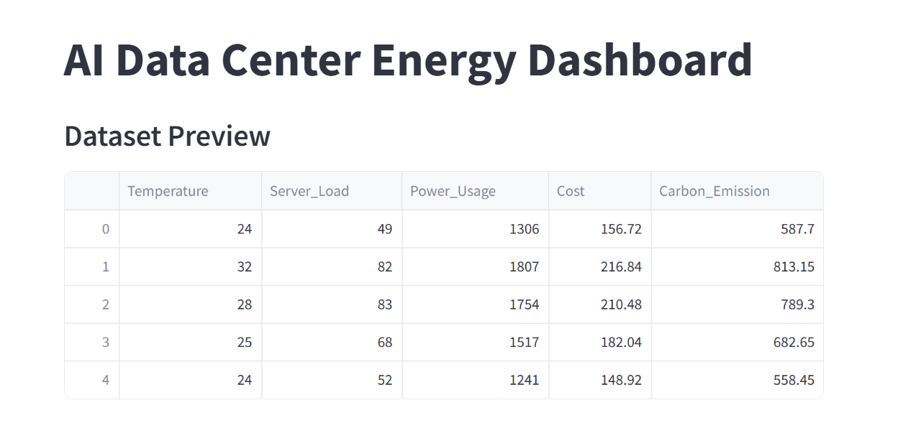
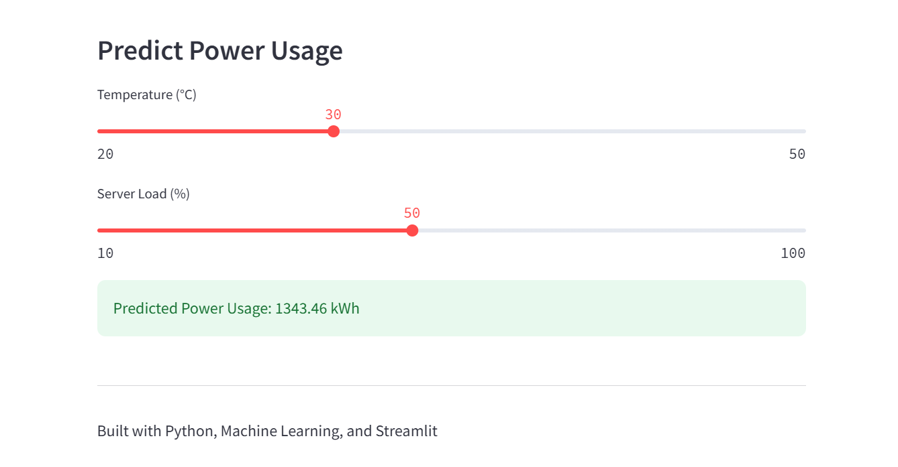
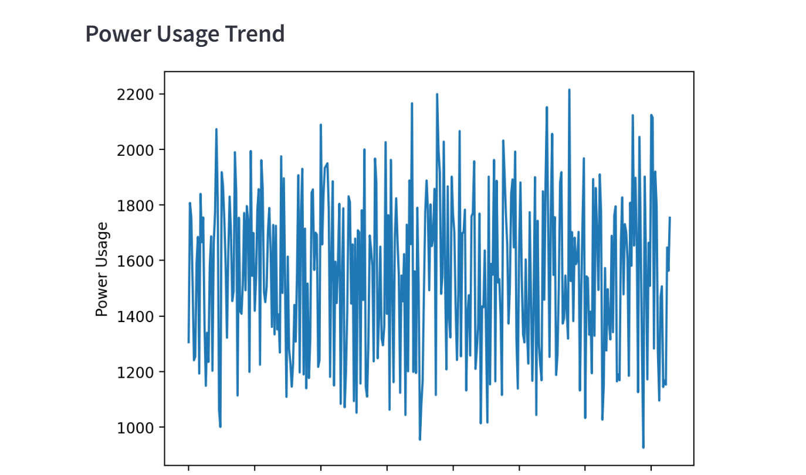

# AI Data Center Energy Dashboard

An AI-powered dashboard for monitoring and predicting data center energy consumption using Machine Learning and Streamlit.

## Dashboard Preview

### Main Dashboard



### Prediction System



### Analytics & Trends



---

## Project Overview

Data centers consume a large amount of electricity and resources. This project simulates a data center environment and uses Machine Learning to predict power usage based on operational conditions.

The dashboard provides visual insights into:

- Power Usage
- Operational Cost
- Carbon Emissions
- Power Consumption Prediction

through an interactive Streamlit web application.

---

## Features

- Synthetic data generation
- Machine Learning-based power usage prediction
- Interactive Streamlit dashboard
- Power usage trend visualization
- Cost monitoring
- Carbon emission analysis
- Real-time prediction using sliders

---

## Technologies Used

- Python
- Pandas
- NumPy
- Scikit-Learn
- Joblib
- Matplotlib
- Streamlit

---

## Project Structure

```text
AI-DataCenter-Energy-Dashboard/

├── data/
│   └── energy_data.csv

├── models/
│   └── energy_model.pkl

├── screenshots/
│   ├── dashboard_home.png
│   ├── prediction_demo.png
│   └── analytics_charts.png

├── app.py
├── generate_data.py
├── train_model.py
├── requirements.txt
└── README.md
```

---

## Installation

Clone the repository:

```bash
git clone https://github.com/your-username/AI-DataCenter-Energy-Dashboard.git
cd AI-DataCenter-Energy-Dashboard
```

Install the required libraries:

```bash
pip install -r requirements.txt
```

---

## Running the Project

### Step 1: Generate Dataset

```bash
python generate_data.py
```

### Step 2: Train the Machine Learning Model

```bash
python train_model.py
```

### Step 3: Launch the Dashboard

```bash
streamlit run app.py
```

### Step 4: Open in Browser

Open the following URL in your browser:

```text
http://localhost:8501
```

---

## Machine Learning Model

This project uses a **Linear Regression** model.

### Input Features

- Temperature
- Server Load

### Target Variable

- Power Usage

The trained model is stored in:

```text
models/energy_model.pkl
```

---

## Sample Dashboard Functions

### Power Usage Trend

Visualizes historical power consumption patterns.

### Cost Trend

Displays changes in operational costs over time.

### Carbon Emission Trend

Tracks estimated carbon emissions from data center operations.

### Power Usage Prediction

Predicts future power usage based on temperature and server load values selected by the user.

---

## Future Improvements

- Random Forest Regression
- XGBoost Integration
- Deep Learning Models
- Real-Time Monitoring
- Cloud Deployment
- Energy Optimization Recommendations
- Predictive Maintenance System

---

## Learning Outcomes

Through this project, I gained practical experience in:

- Data Generation
- Data Analysis
- Machine Learning
- Model Training
- Model Serialization with Joblib
- Data Visualization
- Streamlit Dashboard Development
- End-to-End AI Project Workflow

---

## Author

Built by **Samiha Fatima** as part of a Machine Learning and AI portfolio project.

---

## License

This project is available for educational and learning purposes.
